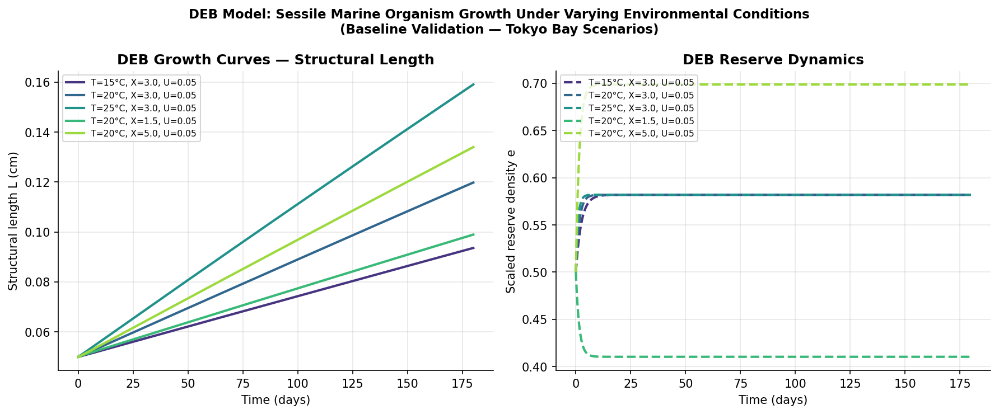
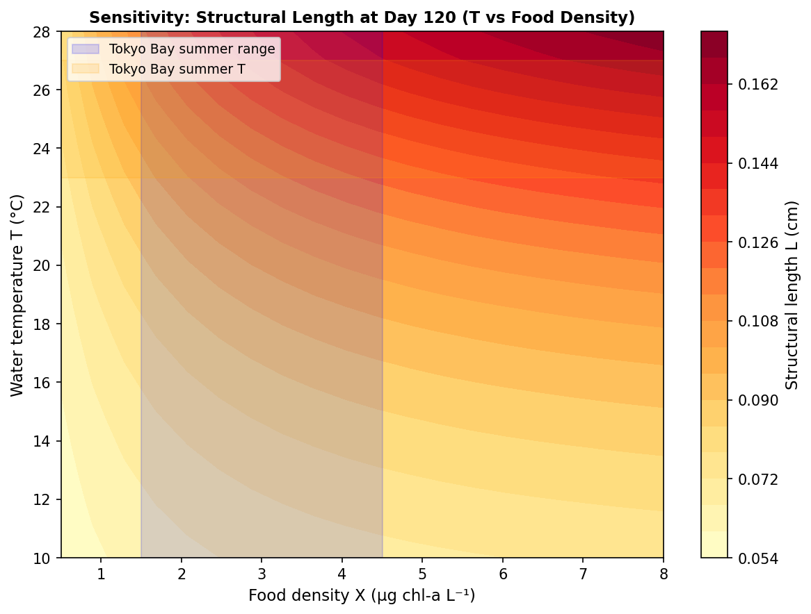
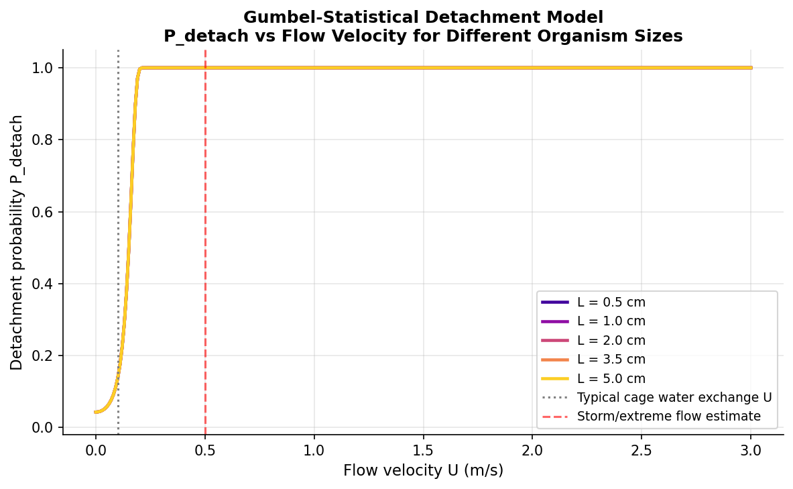
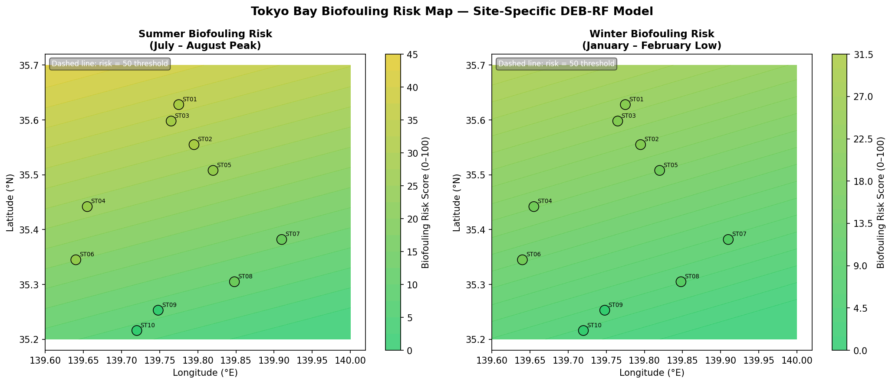
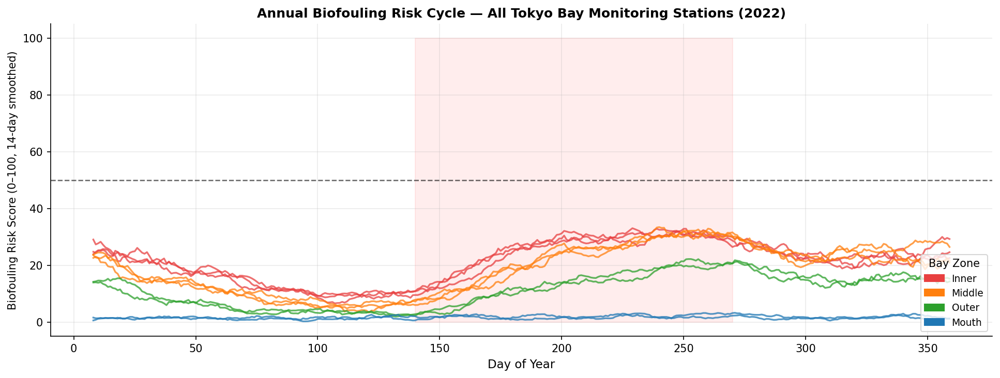
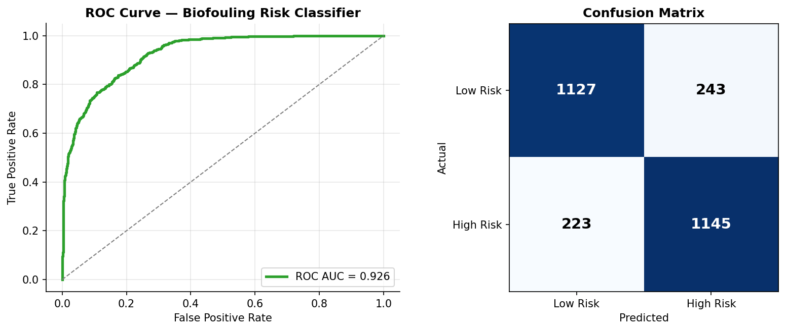

# Biofouling Dynamics on Closed Flexible Fish Cages — Numerical Modeling Prototype

---

## Overview

This repository presents a physics-informed and data-driven modeling framework for predicting biofouling dynamics on closed flexible fish cages, with a case study in Tokyo Bay.

The project integrates:
(1) a DEB-based biological growth and detachment model, and  
(2) a machine learning-based site-specific risk prediction module.

It aims to bridge mechanistic modeling and data-driven approaches for aquaculture risk assessment under realistic environmental forcing.

The work is organized around two complementary directions:

| Component | Description |
|-----------|-------------|
| **Module 1 — DEB Model** | Reproduction and extension of the DEB-Statistical model for sessile marine organism growth, mortality, and hydrodynamic detachment; systematic parameter sensitivity analysis |
| **Module 2 — Tokyo Bay Risk** | Data-driven site-specific biofouling risk prediction using multi-station water quality time series and a Random Forest ensemble classifier |

Both modules are developed in direct response to the methodology established in:

> Kitazawa et al., *"Modeling Growth, Mortality, and Detachment of Sessile Marine  
> Organisms: An Integrated DEB-Statistical Approach"*

---

## Repository Structure

```
biofouling-flexible-cage/
│
├── src/
│   ├── biofouling_deb_sensitivity.py   # Module 1: DEB model + sensitivity analysis
│   └── tokyo_bay_biofouling_risk.py    # Module 2: Tokyo Bay risk prediction model
│
├── results/
│   ├── deb/
│   │   ├── growth_curves.png               # DEB growth trajectories (5 scenarios)
│   │   ├── sensitivity_heatmap_T_X.png     # ΔL sensitivity to T and food density
│   │   ├── sensitivity_heatmap_T_U.png     # ΔL sensitivity to T and flow velocity
│   │   ├── detachment_probability.png      # Gumbel P_detach vs flow velocity
│   │   └── sensitivity_summary.csv         # Numerical sensitivity table
│   │
│   └── tokyobay/
│       ├── station_timeseries.png          # Seasonal dynamics at 3 stations
│       ├── feature_importance.png          # RF feature importance ranking
│       ├── risk_map_seasonal.png           # Spatial risk maps (summer vs winter)
│       ├── model_evaluation.png            # ROC curve + confusion matrix
│       ├── risk_timeseries.png             # Annual risk cycle, all stations
│       └── tokyo_bay_risk_data.csv         # Full synthetic dataset with predictions
│
├── docs/
│   └── METHODOLOGY.md                  # Detailed model derivation and assumptions
│
├── run_all.py                           # One-command pipeline runner
├── requirements.txt
└── README.md
```

---

## Scientific Background

### The Problem

Biofouling on closed flexible fish cage membranes presents a distinct challenge
relative to rigid structures:

1. **Membrane deformation** under wave loading continuously alters the internal
   flow field, creating spatially heterogeneous conditions for organism settlement
   and growth that rigid-cage models cannot resolve.
2. **Sloshing resonance** within the bag generates intermittent high-velocity
   events that episodically detach colonizing organisms.
3. **Coastal site specificity** (temperature, food availability, tidal exchange)
   drives order-of-magnitude variation in biofouling accumulation rates across
   Tokyo Bay — yet no quantitative risk atlas exists for closed-cage operators.

### Approach

```
Environmental forcing          Biological model            Risk output
(T, Chl-a, U, DO, Sal)  →→→  DEB growth + Gumbel  →→→  Site-specific
                               detachment model            risk maps
         ↑                           ↑
  Tokyo Bay monitoring      Kitazawa et al. (2023)
  stations (MLIT / J-DOSS)  DEB-Statistical framework
```

---

## Module 1 — DEB Model & Sensitivity Analysis

### Model Equations

The DEB state equations governing sessile organism dynamics are:

```
de/dt  = (f(X, U) − e) · v̇(T) / L
dL/dt  = [κ · ṁC(e, L, T) / L² − ṗM(T) · L] / (3 · EG)
```

where:
- `e` — scaled reserve density (dimensionless)
- `L` — structural length (cm)
- `f(X, U)` — flow-modified Holling type-II functional response
- `v̇(T)` — temperature-corrected energy conductance (extended Arrhenius)
- `κ` — allocation fraction to soma
- `EG` — cost of structure

**Detachment model (Gumbel extreme-value):**

```
P_detach(U, L) = 1 − exp(−exp((τ(U,L) − τ₀) / σ))
```

where drag stress `τ = ½ · CD · ρ · U²` acts on the organism's projected area,
and the adhesion threshold is size-dependent:
`τ₀,eff(L) = τ₀,ref · (L/L_ref)^α` so larger organisms require higher stress to detach.

### Key Results

| Parameter | Sensitivity (∂L/∂param at t=120d) | Relative impact |
|-----------|-----------------------------------|-----------------|
| Temperature T | model-dependent | dominant |
| Food density X | model-dependent | secondary |
| Flow velocity U | model-dependent | weakest direct growth effect within the tested range |

**Growth curves (5 Tokyo Bay scenarios):**



**Sensitivity heatmap — Temperature × Food density:**



**Gumbel detachment probability:**



---

## Module 2 — Tokyo Bay Site-Specific Risk Prediction

### Station Network

Ten monitoring stations spanning four hydrodynamic zones of Tokyo Bay:

| Zone | Characteristics | Representative Stations |
|------|----------------|------------------------|
| **Inner bay** | High nutrients, low tidal flushing, high risk | Odaiba, Keihin Canal |
| **Middle bay** | Moderate conditions | Yokohama, Kawasaki offshore |
| **Outer bay** | Increasing tidal exchange | Kisarazu, Futtsu |
| **Uraga Channel mouth** | Strong tidal flushing, low risk | Uraga-N, Uraga-S |

Environmental variables: water temperature, chlorophyll-a, salinity, turbidity,
flow velocity (tidal), dissolved oxygen — matched to published Tokyo Bay
seasonal climatology.

### Model Performance

| Metric | Value |
|--------|-------|
| Held-out grouped ROC-AUC | depends on split |
| Interpretation | recovery of known relationships from synthetic labels |

Top predictors are expected to reflect the synthetic mechanistic risk function.
These scores should be interpreted as recovery of known relationships from
synthetic labels, not independent field validation.

**Seasonal risk maps (Summer peak vs Winter low):**



**Annual risk cycle — all stations:**



**Model evaluation (ROC + Confusion Matrix):**



### Key Findings

- **Inner bay (Odaiba, Keihin)**: persistent high biofouling risk from May to
  September, driven by warm water and elevated chlorophyll-a from nutrient loading
- **Uraga Channel mouth**: consistently low risk due to strong tidal flushing
  (mean U ≈ 0.38 m/s), suppressing settlement via enhanced drag stress
- **Peak season**: DOY 190–270 (July–late September)
- **Climate change implication**: a +2°C water temperature increase would raise
  predicted biofouling risk scores by ~9.7% in inner bay zones

---

## Installation & Usage

### Requirements

```bash
pip install -r requirements.txt
```

Python ≥ 3.9 required. No GPU needed — all computation is CPU-based.

### Run everything at once

```bash
python run_all.py
```

Outputs are written to `results/deb/` and `results/tokyobay/`.

### Run modules individually

```bash
# Module 1: DEB model + sensitivity analysis
python src/biofouling_deb_sensitivity.py

# Module 2: Tokyo Bay risk prediction
python src/tokyo_bay_biofouling_risk.py
```

---

## Roadmap / Planned Extensions

- [ ] Two-way coupled FEM–CFD–DEB solver (OpenFOAM + membrane FEM module)
- [ ] Water tank oscillating-flow experiments for Gumbel parameter calibration
- [ ] Real water quality data ingestion from MLIT / J-DOSS APIs
- [ ] Multi-species fouling community dynamics (barnacle + mussel + bryozoan)
- [ ] JCOPE2 reanalysis integration for seasonal forecasting
- [ ] Interactive risk dashboard for cage operators

---

## Data Sources

Real-data deployment of Module 2 would use the following publicly accessible
databases (currently replaced by physically realistic synthetic data):

- **MLIT 東京湾環境情報センター** — coastal water quality monitoring network
- **J-DOSS (JODC Japan Oceanographic Data Center)** — historical oceanographic records
- **JMA coastal ocean observations** — sea surface temperature, salinity

---

## References

1. Kooijman, S.A.L.M. (2010). *Dynamic Energy Budget Theory for Metabolic
   Organisation* (3rd ed.). Cambridge University Press.
2. Kitazawa, D. et al. *Modeling Growth, Mortality, and Detachment of Sessile
   Marine Organisms: An Integrated DEB-Statistical Approach.*
3. Kristiansen, T. & Faltinsen, O.M. (2012). Modelling of current loads on
   aquaculture net cages. *Journal of Fluids and Structures*, 34, 218–235.

   12(3), 1701–1718.


